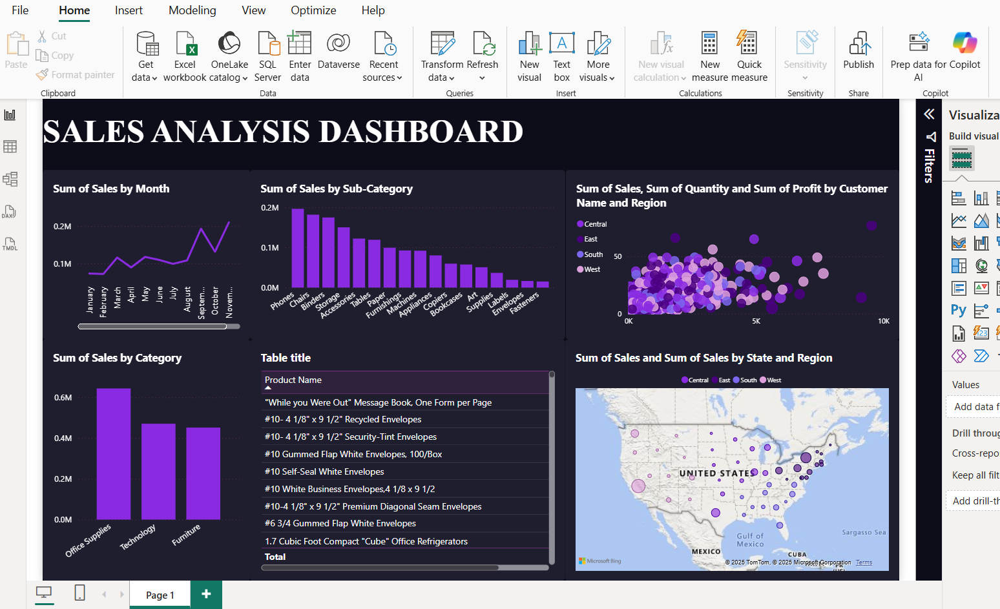

# 🛒 Sales Analysis Dashboard – Task 8 (Data Analyst Internship)

## 📌 Objective
The goal of this task was to design a simple **interactive sales dashboard** in **Power BI** that shows sales performance by **product, region, and category**.

## 📂 Dataset
- **Superstore Sales Dataset** (Columns: Order Date, Region, Category, Sub-Category, Sales, Profit, Quantity, Customer Name)
- Data cleaned (converted Order Date into **Month-Year** format, removed null values).

## 📊 Dashboard Features
- **Line Chart**: Sales trend by Year.
- **Bar Chart**: Sales by Sub-Category.
- **Bar Chart**: Sales by Category.
- **Map Visualization**: Sales by State and Region.
- **Scatter Plot**: Relationship between Sales, Quantity, and Profit by Customer.
- **Table**: Detailed product-level sales.

## 🔍 Key Insights
1. **Office Supplies** generated the highest sales compared to Technology and Furniture.  
2. **Phones and Chairs** were the top-performing sub-categories.  
3. The **West region** had higher sales density compared to other regions.  
4. Sales showed a positive growth trend from **2019 to 2020**.  

## 🛠 Tools Used
- **Power BI** (for visualization & dashboard design)  
- **CSV Dataset** (Superstore Sales)  

## 📷 Dashboard Preview

## 📌 How to Run
1. Download the `.pbix` file (Power BI file) from this repo.  
2. Open in **Power BI Desktop**.  
3. Explore dashboard using slicers/filters.  

## ✅ Outcome
This project demonstrates how to create a **clean, interactive dashboard** to analyze sales performance and extract useful business insights.

---
